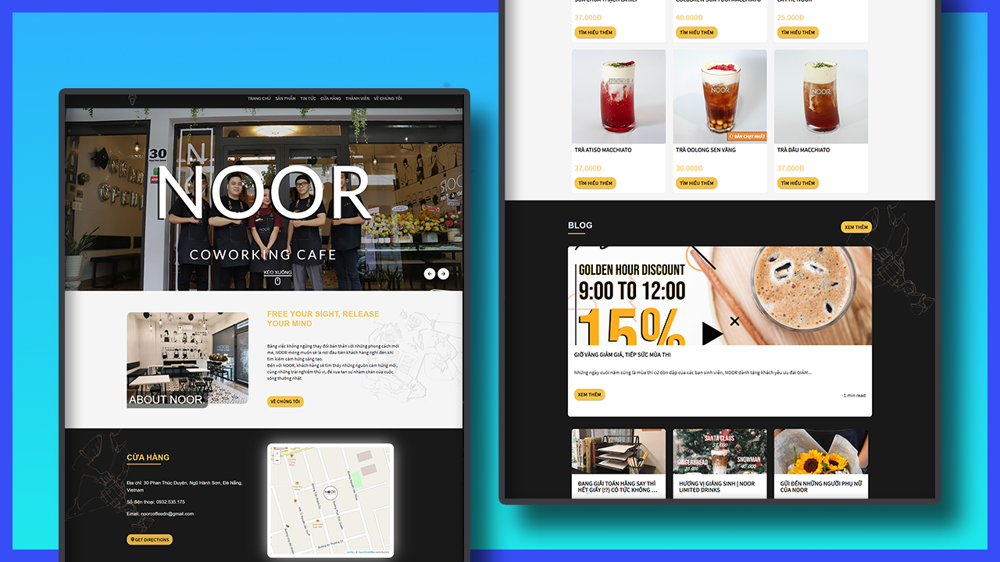
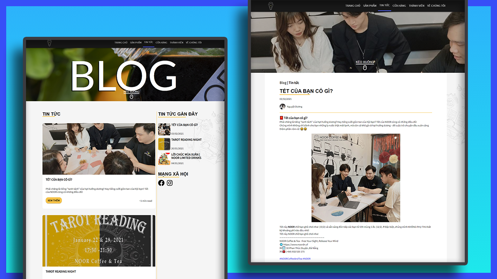
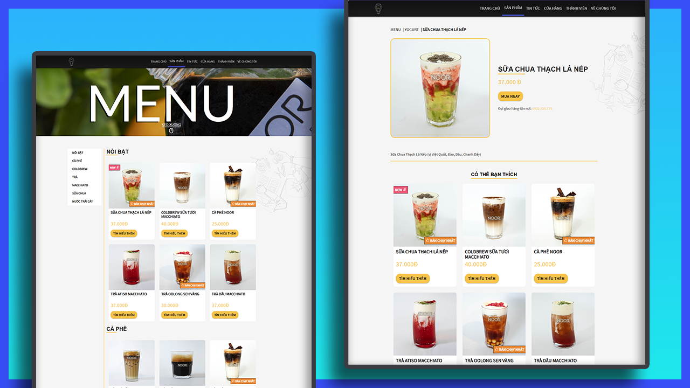
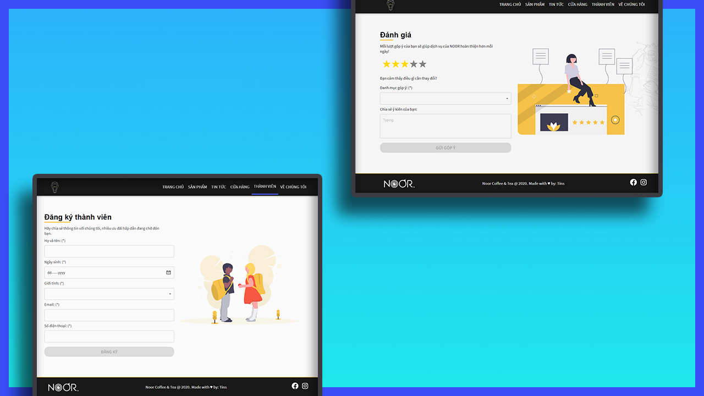
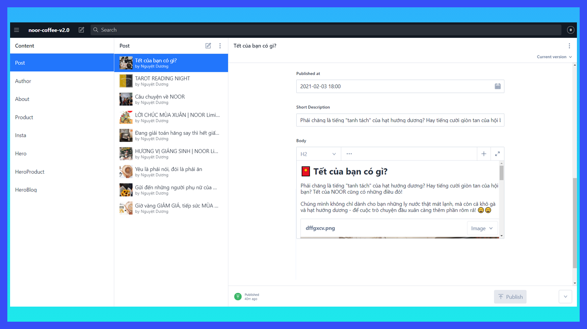
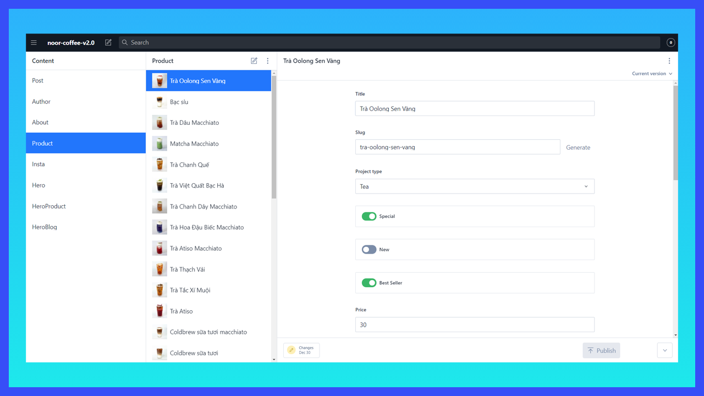

# Project: NOOR Coffee Website v2.0

### Date: Dec - 2020 to Jan - 2021

### Releases

- Client: https://noor-cf.web.app/
- Server: https://server-noorcoffee.sanity.studio/

### Functions

Responsive Design Optimized with 2 screen: Large Screen(>=1280px) and Mobile Screen(<1280px)

**Client:**

- Homepage
- Products / Single Product
- Blogs / Blog post
- Store - Display on Maps
- Membership register
- Feedback register
- About us

**Server:**

- Sanity
  - Blog Posts Management
  - Author of Blog Post Management
  - Products Management
  - Images Management
- Firebase / Google Sheet

  - Membership Management
  - Feedback Management

### Screenshot

**Homepage:**



**Blog Posts / Single Post:**



**List of Products / Single Product:**



**Feedback / Membership register:**



**Blog Posts Management:**



**Products Management:**



## Installation Guide

### Tech-Stack

- React Hooks
- react-router-dom
- redux-toolkit
- @sanity.io
- Firebase
- styled-components
- Material-UI
- react-icons
- leaflet
- react-lazy-load-image-component
- react-scroll
- img design from https://undraw.co/

### Directory Structure

```
.
├── .gitignore
├── package.json
├── package-lock.json
├── README.md
├── deploy-firebase
├── .firebaserc
├── firebase.json
├── public
└── src
```

For the project to build, these must exist with exact filenames:

- `public/index.html` is the page template
- `src/index.js` is the entry point
- `src/GlobalStyles.js` is the Global Styles
- `src/App.js` is the Router

### Production

**Setup Server**

- Clone this project

- Go to `./noorcoffeev20`

```
cd ./noorcoffeev20
```

- Install dependencies

```
npm install
```

- Start packager, server is running on PORT 5000

```
npm start
```

**Setup Client**

- cd to root folder

- Install dependencies

```
npm install
```

- Start packager, server is running on PORT 3000

```
npm start
```

### Bugs:

- Logo Img on `navbar` & `footer` has margin on IOS devices
- Img on SinglePost on IOS devices has broken
- Components is NOT re-usable

### How to name a folder and a file

- Folder name: - Ex: `InfoSection`
- Component file name: should be -- Ex: `InfoSection.jsx`
- Style component file name: should be -- Ex: `InfoSection.elements.js`

### How to import and export module?

- Import:

```js
//import every thing
import * as React from "react";
import * as ReactDOM from "react-dom";

//for default export
import InfoSection from "./InfoSection";

//for named export
import { InfoSec, InfoRow } from "./InfoSection.elements";
```

### How to style for each component?

- Create a styled-component file. Ex: `InfoSection.elements.js`
- Import to `jsx` file

```js
// InfoSection.jsx

import { InfoSec, InfoRow } from "./InfoSection.elements";
```
